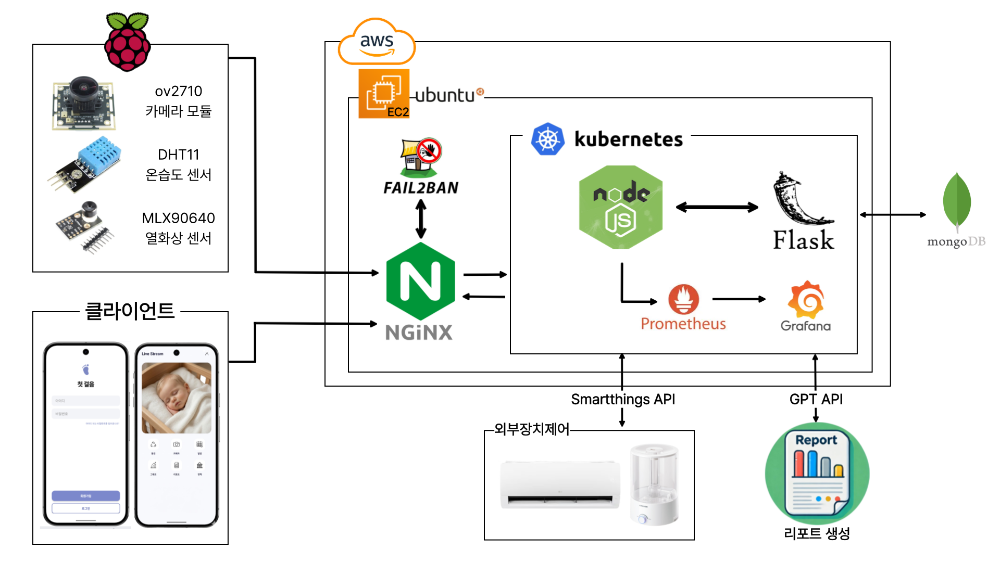

# 🍼 AIoT 기반 신생아 케어 보조 시스템

### AIoT 기반 신생아 환경 모니터링 및 자동 제어 시스템

---

## 📌 프로젝트 소개

AI(Artificial Intelligence)와 IoT(Internet of Things)를 결합하여 신생아의 상태와 주변 환경을 실시간으로 분석하고 보호자에게 정보를 제공하는 **AIoT 기반 스마트 육아 보조 시스템**입니다.

센서·카메라·마이크를 통해 수집된 데이터를 AI 분석 모델로 처리하여 **환경 모니터링, 체온 감지, 울음 감지, 자동 환경 제어, 리포트 생성 기능**을 제공합니다.

특히, **Docker와 Kubernetes 기반의 클라우드 네이티브(Cloud Native) 아키텍처**로 인프라를 구축하여, 서비스 확장이 용이하고 시스템 장애 발생 시 스스로 복구하는 고가용성 운영 환경을 구현했습니다. 보호자는 모바일 애플리케이션을 통해 언제 어디서나 신생아의 상태를 실시간으로 안전하게 확인하고 알림을 받을 수 있습니다.

---

# 🎯 설계 목적

### 1. 클라우드 네이티브 기반 고가용성 인프라 구축 및 운영
* Docker 컨테이너라이징 및 Kubernetes 오케스트레이션을 통한 고가용성 아키텍처 설계
* 시스템 장애 시 자동 복구(Auto-healing) 및 지속적인 상태 관측(Observability) 환경 체득

### 2. IoT 센서 네트워크 설계 및 데이터 통신 구조 이해
* 센서 데이터 수집 및 실시간 통신 구조 설계
* IoT 디바이스 간 데이터 흐름 이해

### 3. AI 기반 신호 분석 및 감지 알고리즘 설계
* 영상 및 음성 데이터 분석
* 객체 인식 및 상태 분석 모델 적용

### 4. 통합 하드웨어 설계 경험 습득
* 센서·카메라·마이크 기반 시스템 구축
* Raspberry Pi 기반 AIoT 환경 구성

### 5. 실시간 모니터링 및 리포트 시스템 구현
* Dashboard UI/UX 설계
* 데이터 시각화 및 분석 기능 구현

### 6. 스마트홈 연동 및 자동 제어 구현
* SmartThings 기반 자동 제어
* 실시간 환경 최적화

---

# 🧠 기술 스택

| 영역 | 기술 |
| ------------------ | ----------------------------------------------------------------------------- |
| **AI / 분석** | YOLO · MediaPipe · Wav2Vec · ONNX Runtime |
| **Backend** | Node.js · Flask · REST API · Scheduler |
| **Database** | MongoDB |
| **Mobile** | Android Studio · Java · Dashboard UI |
| **IoT / Hardware** | Raspberry Pi · Camera Module · Thermal Camera · Temperature & Humidity Sensor |
| **Smart Home** | SmartThings API |
| **DevOps / Infra** | Docker · DockerHub · Kubernetes · Nginx · AWS |
| **Collaboration** | Git · GitHub |

---

# 🚀 주요 기능

| 기능 | 설명 |
| --------------- | -------------------- |
| 🌡️ 온·습도 감지 | 실시간 환경 측정 및 이상 환경 감지 |
| 📷 베이비캠 및 체온 감지 | 얼굴 검출 및 열화상 기반 체온 분석 |
| 🎤 울음 감지 | Wav2Vec 기반 울음 여부 분석 |
| 📊 AI 리포트 생성 | 수면 및 환경 변화 데이터 시각화 |
| 🏠 자동 환경 제어 | SmartThings 기반 자동 제어 |
| 🔔 사용자 알림 | 이상 상태 발생 시 실시간 알림 |
| 🔐 사용자 인증 | 회원가입 및 로그인 |
| 📱 실시간 모니터링 | 모바일 Dashboard 제공 |
| 📅 육아 일정 관리 | 예방접종 및 검진 일정 알림 |
| 📈 로그 및 통계 | 이상 이벤트 저장 및 통계 |
| ♻️ 오토힐링 | 서버 장애 자동 복구 |
| 📡 관측가능성 | 시스템 모니터링 및 상태 관리 |

---

# 👥 팀 수행 내용

## 📌 기획 및 설계

* 시장 조사 및 요구사항 분석
* 기능 블록도 설계
* 시스템 아키텍처 설계
* 서비스 정책 정의
* 통합 테스트 계획 수립

### 사용 기술

`Draw.io`
`Architecture Design`
`Functional Block Diagram`

---

## 📌 AI 분석 시스템 개발

* 얼굴 검출 및 영역 분석
* 울음 감지 모델 학습
* AI 추론 서버 구축
* 수면 점수 분석
* 리포트 생성 기능 구현

### 사용 기술

`YOLO`
`MediaPipe`
`Wav2Vec`
`ONNX Runtime`
`Flask`
`Python`

---

## 📌 IoT 및 하드웨어 개발

* 센서 데이터 수집
* 카메라 및 스트리밍 구현
* 열화상 체온 분석
* SmartThings 자동 제어 연동

### 사용 기술

`Raspberry Pi`
`Temperature Sensor`
`Humidity Sensor`
`Camera Module`
`Thermal Camera`
`SmartThings API`

---

## 📌 서버 및 백엔드 개발

* API 서버 구축
* AI 서버 연동
* 사용자 인증
* 이벤트 및 알림 처리
* 스케줄링 기능 개발

### 사용 기술

`Node.js`
`Flask`
`REST API`
`MongoDB`

---

## 📌 모바일 및 사용자 서비스 개발

* Dashboard UI 구성
* 데이터 시각화
* 푸시 알림
* 일정 관리 기능

### 사용 기술

`Android Studio`
`Java`

---

## 📌 인프라 및 운영 환경 구축

* 컨테이너 환경 구성
* 배포 및 운영 자동화
* 오토힐링 구성
* 관측가능성 환경 구축

### 사용 기술

`Docker`
`DockerHub`
`Kubernetes`
`Nginx`
`AWS`
`Git`
`GitHub`

---

# 🏗 시스템 아키텍처

  

---

# 📈 기대 효과

* 신생아 상태 실시간 분석
* 보호자 육아 부담 감소
* 스마트홈 기반 자동 케어 환경 구축
* AI 기반 예방형 육아 서비스 제공

# 👥 팀 수행 내용 및 역할 분담

| 이름 | 구분 | 주요 역할 및 수행 내용 |
| :---: | :---: | :--- |
| **박희수** | IoT 개발 | • 프로젝트 총괄 및 시장 조사, 시스템 아키텍처 구성 • 개발 기술 조사 및 SmartThings 기능 구현 • YOLO 기반 객체 분류 및 상태 분석 모델 학습 • Raspberry Pi 기반 센서 데이터 수집 및 IoT 서버/기기 개발 • IoT 기기 외형 설계 및 3D 모델링 제작 • 통합 테스트 사전 준비 및 프로젝트 광고 영상 제작 |
| **김규진** | IoT 개발 | • 개발 기술 조사 및 기능 블록도 구성, 시스템 아키텍처 구성 • Flask 서버 구성 및 영상/음성 추론 엔진 구현 • Wav2Vec 기반 아기 울음 감지 및 YOLO 기반 분류/분석 모델 학습 • MediaPipe 모델 적용 (얼굴 감지) 및 모델 ONNX 변환/양자화 • Raspberry Pi 센서 데이터 수집, 스트리밍 구현 및 Android Studio 영상 기능 구현 • SmartThings 연동, 수면 점수 알고리즘 기능 구현 및 IoT 외형 설계/모델링 참여 |
| **이민성** | 서버 / 인프라 개발 | • 팀 회의록 작성 및 시스템 아키텍처/기능 블록도 설계 총괄 • Node.js 및 Flask 멀티 서버 아키텍처 구성 • Android Studio 연동 및 Frontend UI/UX 모바일 대시보드 구현 • MongoDB 데이터베이스 설계 및 SmartThings, 정책 서비스 연동 • 백엔드 스케줄링 기능 및 수면 점수 산출 기능 구현 • Docker Desktop/DockerHub 연동 및 컨테이너라이징 • Nginx 리버스 프록시 및 Kubernetes(K8S) Cluster 기반 고가용성 인프라 구축 • Git 레포지토리 병합 관리 및 통합 테스트 사전 준비 |
| **노영우** | 서버 개발 | • 인프라 및 서버 개발 기술 조사, 기능 블록도 구성 • Node.js 기반 백엔드 API 서버 구성 • 사용자 인증 시스템(로그인, Gmail SMTP 연동 인증) 구현 • 마이페이지 정보 조회 및 수정 기능 구현 • SmartThings API 연동 기능 개발 • AWS 인프라 서버 환경 구성 및 통합 테스트 사전 준비 |
| **김지환** | DB 모델링 / AI | • 시장 조사 및 최신 개발 기술 트렌드 분석 • 데이터 모델링을 위한 NoSQL DB ERD 구조 설계 • 시스템 기능 블록도 구성 참여 • 신생아 케어 특화형 AI 서비스 설계 및 ChatGPT API 연동 기능 개발 |

---